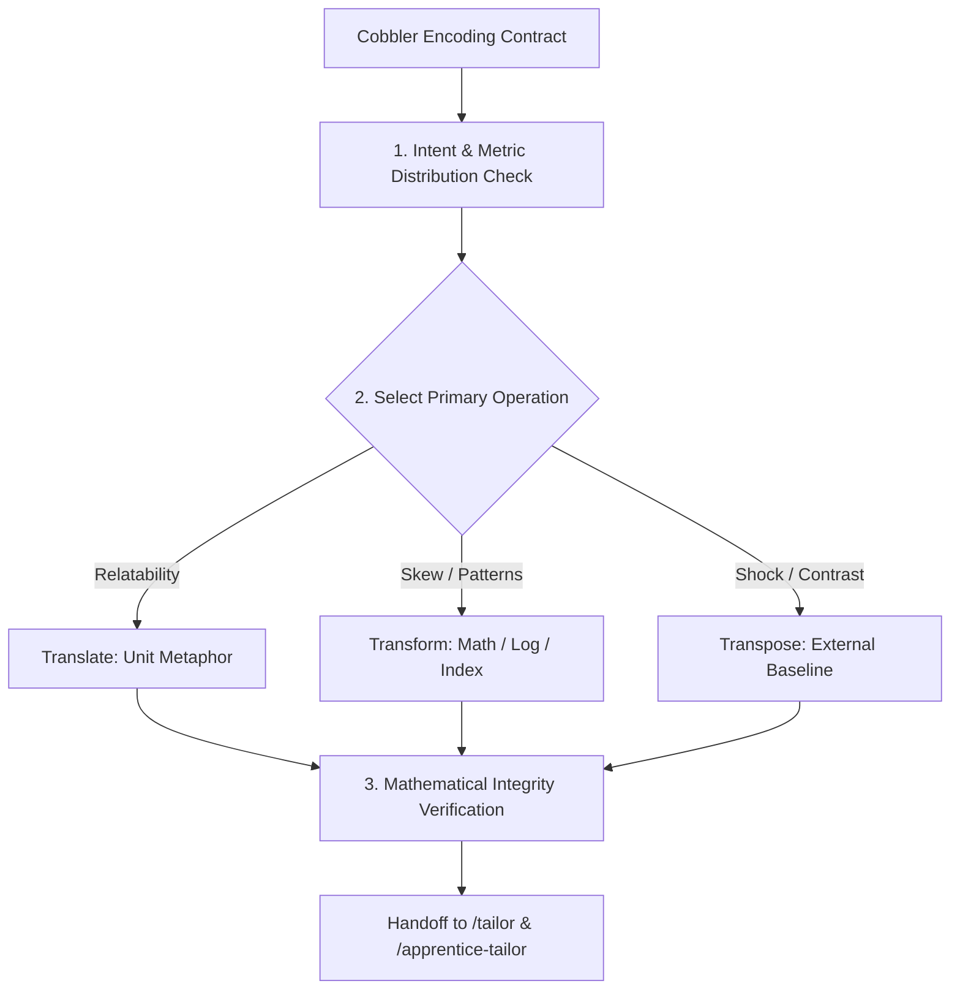

# Carpenter

## Overview

Carpenter is the framing and joinery specialist of the workshop. It receives the structural NOIR encoding contract from `/cobbler` [cite: 5] and determines how data values are framed before styling begins [cite: 2, 3]. While Cobbler decides *which channel* encodes a metric (e.g., length, position) [cite: 5], Carpenter decides *how that metric speaks* to human cognition [cite: 2, 3]. 

Carpenter selects and executes one of three operations—**Translate**, **Transform**, or **Transpose**—ensuring the visualization bridges the gap between raw database figures and visceral, memorable comprehension [cite: 2, 3].

## Core Rule

Never distort underlying proportions or deceive the viewer in pursuit of impact. 

Every transformation (e.g., logarithmic scales, normalization indices) or translation (e.g., converting dollars to daily wages) must preserve mathematical veracity, declare its mathematical unit baseline explicitly, and carry clear annotation requirements forward to `/tailor` [cite: 2, 3].

## The Three Carpenter Operations

Carpenter evaluates the intent posture from `/vizhard` [cite: 2, 3] and the Ratio/Interval metrics from `/cobbler` [cite: 5] to select the primary framing strategy:

### 1. Translate (Human-Scale Relatability)
Converts abstract or unfathomably large metrics into tangible, experiential units familiar to the target audience.
- **Use Cases:** Ideal for `general-overview` or `playful-expressive` postures [cite: 2, 3].
- **Examples:**
  - Raw runtime in minutes (`180 min`) $\rightarrow$ Translated into "Number of standard sitcom episodes" or "Length of an average domestic flight."
  - Massive box office gross (`$1,000,000,000`) $\rightarrow$ Translated into "Median annual household budgets" or "Cost to fund a municipal library system for 40 years."
- **Contract Rule:** Must output a discrete conversion factor ($k$) and a clear unit label string.

### 2. Transform (Mathematical & Distribution Rescaling)
Applies rigorous mathematical operations to resolve skewed distributions, dynamic range compressions, or baseline misalignments.
- **Use Cases:** Essential for `pattern-discovery` posture [cite: 2, 3].
- **Operations:**
  - **Logarithmic / Power Scaling:** Unpacks heavy right-tailed distributions (e.g., box office gross, vote counts) so dense clusters are legible across orders of magnitude.
  - **Normalization / Indexing:** Re-centers metrics around a reference baseline (e.g., Index $= 100$ as the median IMDb rating; distances measured as percentage deviations $+/-$ from benchmark).
  - **Per-Capita / Density Adjustments:** Divides gross earnings by runtime or budget to evaluate efficiency.

### 3. Transpose (Editorial Friction & Shock Juxtaposition)
Pairs the dataset's metrics against unexpected, contrasting external baselines or socio-economic realities to create cognitive dissonance and emotional weight.
- **Use Cases:** Mandatory for `impact-shock` and `dataset-juxtaposition` postures [cite: 2, 3].
- **Examples:**
  - Box office revenue plotted directly against the total national GDP of small island nations or disaster relief deficits.
  - Film budgets juxtaposed against local public school funding shortfalls during the same release year.
- **Contract Rule:** Must define the secondary external reference series and calculate the contrast ratio ($R = \text{Metric} / \text{Baseline}$).

## Workflow



1. **Audit Distribution & Scale:**
   Inspect min, max, median, and skewness of the primary Ratio metrics passed from `/cobbler` [cite: 5].
2. **Select Operation:**
   Match the operational need to the `intent_mode` passed from `/vizhard` [cite: 2, 3].
3. **Execute Transformation / Translation Formula:**
   Apply the mathematical formulas using deterministic code.
4. **Draft Annotation Requirements:**
   Specify exact caveat text and baseline explanations that `/tailor` must render visually [cite: 2, 3].
5. **Compile Handoff Contract:**
   Package the transformed data schema and annotation mandates for `/tailor` [cite: 2, 3].

## Handoff Contract to `/tailor`

```yaml
carpenter_handoff:
  selected_operation: "transform" # [translate | transform | transpose]
  primary_metric: "gross_usd"
  transformation_logic:
    method: "log10"
    formula: "log10(gross_usd)"
    rationale: "Extreme positive skew: Top 1% gross ($1B+) crushes 95% of films into bottom 10px of linear scale."
  translated_units: null
  transpose_baseline: null
  mandatory_annotations:
    - target_axis: "y_axis"
      label: "Box Office Gross (USD, Logarithmic Scale)"
      tick_format: "$1M, $10M, $100M, $1B"
    - target_callout: "scale_caveat"
      text: "Values scaled logarithmically; each major horizontal gridline represents a 10x increase in box office earnings."
  ready_for_tailor: true
```
