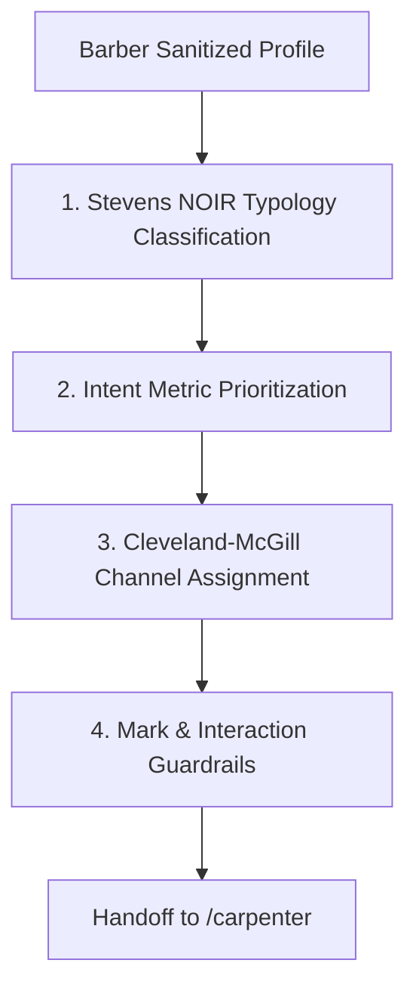

# Cobbler

## Overview

Cobbler is the visual language cartographer of the workshop. It receives the pruned and sanitized dataset contract from `/barber` [cite: 4] and translates abstract database fields into perceptual visual channels [cite: 2, 3]. Cobbler does not write CSS, choose fonts, or apply metaphors [cite: 2, 3]; it grounds data dimensions strictly in empirical graphical perception science (Stevens' scale taxonomy, Cleveland-McGill perceptual accuracy rankings, and Jacques Bertin's visual variables) before passing the structural encoding manifest to `/carpenter` [cite: 2, 3].

## Core Rule

Visual channel mapping must be governed strictly by perceptual research, never arbitrary preference. 

Do not encode continuous quantitative metrics with weak or non-perceptual channels (e.g., color hue alone or 3D volume) when higher-accuracy channels (position along a common scale, length) are unassigned. 

Every column retained by `/barber` must be classified under NOIR and either mapped to an explicit visual mark/channel or declared a tooltip/reference attribute [cite: 4].

## Theoretical Frameworks

Cobbler enforces two scientific pillars:

### 1. Stevens' Measurement Typology (NOIR)
Every variable is classified into one of four distinct operational scales:
- `Nominal`: Qualitative categories without inherent order (e.g., `genre`, `director_name`). Permissible channels: color hue, spatial clustering, categorical glyphs.
- `Ordinal`: Qualitative categories with explicit ranking/order but non-measurable intervals (e.g., `survey_likert_scale`, `medal_tier`). Permissible channels: ordered position, luminance/lightness, sequential saturation, point size.
- `Interval`: Quantitative data where intervals between numbers are equal, but zero is arbitrary (e.g., `temperature_celsius`, `calendar_year`). Permissible channels: linear spatial axes, divergence from reference line.
- `Ratio`: Quantitative data with a meaningful absolute zero where multiplication/division is valid (e.g., `gross_usd`, `runtime_min`, `vote_count`). Permissible channels: position on common scale, bar length, dot position, area (with strict quadratic scaling).

### 2. Cleveland & McGill Perceptual Channel Ranking
Channels are prioritized from highest visual decoding accuracy to lowest:
1. **Position along a common scale** (highest perceptual accuracy; reserved for primary metrics)
2. **Position along identical non-aligned scales** (small multiples / faceted grids)
3. **Length** (bar/column extents, line spans)
4. **Direction / Angle / Slope** (trend lines, slope charts, radial vectors)
5. **Area** (bubble charts, circle packing; must preserve quadratic $r = \sqrt{\text{val}}$ scaling)
6. **Volume / Curvature** (strictly avoided due to severe human decoding error)
7. **Color Saturation & Lightness** (reserved for secondary sequential/diverging quantitative variables)
8. **Color Hue** (strictly reserved for qualitative/nominal distinctions $\le 7$ classes)

## Workflow



1. **Ingest Barber Handoff:**
   Read `columns_retained`, data types, cardinality, and numerical distributions from `/barber` [cite: 4].
2. **Assign NOIR Types:**
   Categorize each column as Nominal, Ordinal, Interval, or Ratio.
3. **Rank Channel Importance:**
   Cross-reference the intent: allocate Rank 1 (Position on Common Scale) to the core dependent variable, Rank 2 to the independent grouping/temporal axis.
4. **Select Mark Archetype:**
   Assign base geometric marks (`point`, `bar`, `line`, `area`, `tick`, `rule`) based on NOIR combinations.
5. **Compile Encoding Manifest:**
   Package the mappings into the handoff contract for `/carpenter` [cite: 2, 3].

## Mark & Channel Assignment Guardrails

- **The Hue Threshold:** Never assign `color_hue` to Nominal variables with cardinality $> 7$. If categories exceed 7, group into Top $N$ + "Other", or shift the category to small-multiple facets.
- **Ratio Zero-Baseline Rule:** Any Ratio metric mapped to `length` (e.g., bar chart) must include zero on its spatial axis. Interval metrics or scatter point positions along a common scale may truncate the axis if explicitly labeled.
- **Area Perceptual Compensation:** Area marks must never map linear data to circle radii ($r \neq x$). Radius must always scale to the square root ($r = \sqrt{x}$).

## Handoff Contract to `/carpenter`

```yaml
cobbler_handoff:
  dataset_source: "imdb_top_1000_sanitized.tsv"
  record_count: 1000
  variable_classifications:
    - field: "series_title"
      noir_type: "nominal"
      cardinality: 1000
      role: "entity_label"
      assigned_channel: "hover_annotation"
    - field: "released_year"
      noir_type: "interval"
      range: [1920, 2020]
      role: "independent_variable"
      assigned_channel: "x_position"
      axis_scale: "temporal_linear"
    - field: "gross_usd"
      noir_type: "ratio"
      zero_anchor: true
      role: "primary_dependent_metric"
      assigned_channel: "y_position"
      axis_scale: "ratio_linear"
    - field: "imdb_rating"
      noir_type: "interval"
      role: "secondary_metric"
      assigned_channel: "color_lightness_sequential"
    - field: "genre"
      noir_type: "nominal"
      cardinality: 14
      role: "grouping"
      assigned_channel: "facet_row_or_filter"
  recommended_mark: "point"
  perceptual_ranking_level: "position_common_scale"
  ready_for_carpenter: true
```
