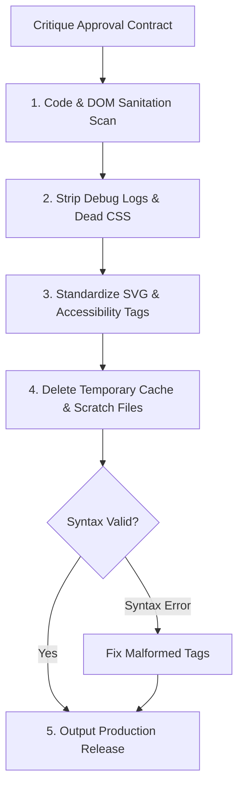

# Janitor

## Overview

Janitor is the terminal sanitary engineer of the workshop. It receives the approved (or conditionally approved) visual artifact and review manifest from `/critique` [cite: 3]. While previous artisans build and polish concept and form, Janitor strips operational waste, enforces clean production code hygiene, removes intermediate scratch tables generated during the pipeline, and certifies that the deliverable is zero-dependency, syntactically clean, and ready for deployment or direct user handoff [cite: 3].

## Core Rule

Janitor never alters visual design tokens, narrative wording, layout geometry, or statistical values approved by `/critique`. 

Its mandate is strictly code hygiene, asset minification, dead-code elimination, syntax validation, and workspace tidying.

## Sanitation Standards

Janitor executes five non-negotiable cleanup protocols:

### 1. Code Scrubber (HTML / SVG / JS / CSS)
- **Purge Unused Declarations:** Scan CSS blocks and remove unused selectors, lingering utility classes, and reset leftovers.
- **Scrub Debug Telemetry:** Strip all developer traces, including `console.log()`, `console.time()`, commented-out experimental blocks, and TODO markers.
- **Minify Inline Scripts:** Collapse redundant whitespace, standardize indentations to 2 spaces, and remove trailing semicolons/commas where valid.

### 2. Markup & SVG Hygiene
- **ID & Class Deduping:** Ensure every DOM element ID is globally unique; fix duplicated `<clipPath>`, `<linearGradient>`, or `<filter>` definitions.
- **Attributes Standardization:** Ensure all SVG elements declare explicit `viewBox`, `xmlns`, and accessibility `aria-label` / `role="img"` attributes.
- **Dimension Check:** Confirm the top-level container has proper responsive constraints (`width: 100%`, `max-width`, `height: auto`) without rigid hardcoded overflow penalties.

### 3. Intermediate Artifact & Scratch Deletion
- Check active workspace directory for temporary cache files generated by `/barber` or `/carpenter` (e.g., `*_temp.csv`, `*_sanitized.tsv`, intermediate Python run outputs).
- Delete intermediate scratch files, leaving only the primary sanitized dataset and the final visualization file.

### 4. Syntax & Dependency Verification
- Verify HTML / SVG well-formedness: tags properly closed, attributes properly quoted, zero unescaped HTML entities (`&`, `<`, `>`) in text nodes.
- Confirm external CDN links (e.g., Google Fonts or D3.js) use secure `https://` protocols with subresource integrity or clean fallback stacks.

## Workflow



1. **Ingest Critique Manifest:**
   Read `target_artifact` and execute directives listed under `janitor_cleanup_targets` in the critique handoff.
2. **Execute File Scrape:**
   Run regex and DOM sanitization passes over the target file.
3. **Purge Workspace:**
   Delete temporary pipeline files while preserving original source data.
4. **Final Syntax Audit:**
   Execute a deterministic parsing check to ensure zero runtime or rendering crashes.
5. **Issue Completion Report:**
   Output completion report and deliver production release to `/vizhard`.

## Handoff Contract to `/vizhard`

```yaml
janitor_handoff:
  final_artifact: "output_viz.html"
  file_size_bytes: 18420
  optimizations_applied:
    - "Removed 14 unused CSS selectors"
    - "Stripped 4 debugging console.log statements"
    - "Added responsive viewBox and aria-label attributes to root SVG"
    - "Purged temporary dataset scratch: imdb_top_1000_sanitized.tsv"
  syntax_status: "validated_zero_errors"
  pipeline_status: "complete_ready_for_user"
```
